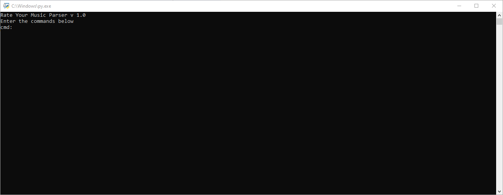

<h3>Rate Your Music Parser<h3>
<h4>Python<h4>

<a href="https://rateyourmusic.com">Rate Your Music</a> is a web-site dedicated to cataloguing and rating music records in a way similiar to <a href="https://imdb.com">IMDB</a>.

RYM has an ability to extract user scores into a .txt file. This Python console application allows you to parse the data from the .txt file and  get statistics on your RYM scores.

You need Python 3 installed on your computer ro run the programm.

Fill list of features (and commands)

<ul>
<li><b>basic-stats</b> - Basic statistics based on all the data</li>
<li><b>album-spreadsheet</b> - List of all albums</li>
<li><b>album-spreadsheet-top</b> - List of all albums (best to worst)</li>
<li><b>album-spreadsheet-bottom</b> - List of all albums (worst to best)</li>
<li><b>album-spreadsheet-year</b> - List of all albums of a certain year</li>
<li><b>album-spreadsheet-year-top</b> - List of all albums of a certain year (best to worst)</li>
<li><b>artist-stats</b> - Basic statistic on artist</li>
<li><b>artist-stats-top</b> - Same as above, but the albums are best to worst</li>

<li><b>top-artists</b> - The Top of Artists by avg. rating</li>
<li><b>top-artists-count</b> - The Top of Artists by Number of Albums</li>
<li><b>top-years</b> - The Top of Years by avg. rating</li>
<li><b>top-decades</b> - The Top of Decades by avg. rating</li>

<li><b>change-filename</b> - Change the data file name</li>
<li><b>set-top-art</b> - Change the amount of albums to check for The Top of Artists</li>
<li><b>set-top-years</b> - Change the amount of albums to check for The Top of Years</li>
<li><b>set-top-decades</b> - Change the amount of albums to check for The Top of Decades</li>
<li><b>add-art-replace</b> - Add artist name for replacement</li>

<li><b>exit</b> - Exit the program</li> 
</ul>

