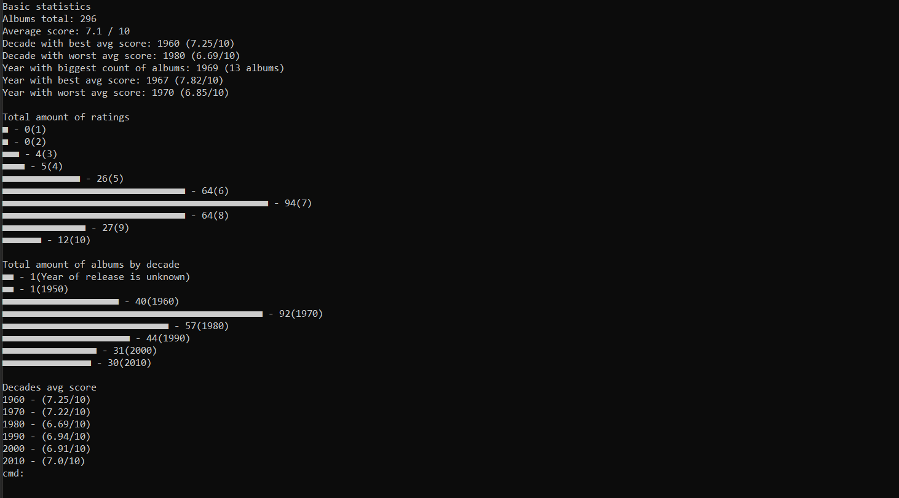

<h3>Rate Your Music Parser<h3>
<h4>Python<h4>
  

This is a small project I made for myself, because I like to work with numbers and statistics. 📈

It's a console application made with Python, no GUI and other fancy stuff, just black screen with commands.
The purpose of this app is to parse data exported by user from Rate Your Music web-site and calculate different statistic based on the data. Such as top of artists based on avarage score, top decades based on avarage score etc. For the application to work you need to have a functioning Rate Your Music account and export your data from there and put the file in the parent folder.

Fill list of features (and commands)

<ul>
<li>bs - Basic statistics based on all the data</li>
<li>as - List of all albums</li>
<li>as-top - List of all albums (best to worst)</li>
<li>as-bottom - List of all albums (worst to best)</li>
<li>as-year - List of all albums of a certain year</li>
<li>as-year-top - List of all albums of a certain year (best to worst)</li>
<li>ars - Basic statistic on artist</li>
<li>ars-top - Same as above, but the albums are best to worst</li>

<li>top-art - The Top of Artists by avg. rating</li>
<li>top-art-count - The Top of Artists by Number of Albums</li>
<li>top-years - The Top of Years by avg. rating</li>
<li>top-decades - The Top of Decades by avg. rating</li>

<li>chf - Change the data file name</li>
<li>set-top-art - Change the amount of albums to check for The Top of Artists</li>
<li>set-top-years - Change the amount of albums to check for The Top of Years</li>
<li>set-top-decades - Change the amount of albums to check for The Top of Decades</li>
<li>add-art-replace - Add artist name for replacement</li>

<li>exit - Exit the program</li> 
</ul>
